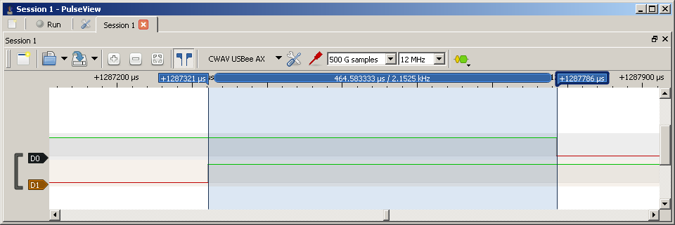
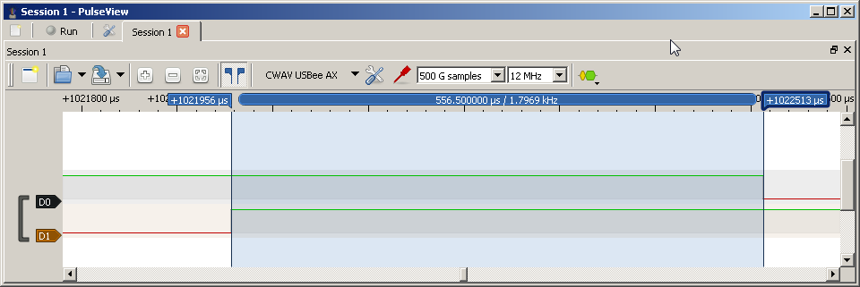

# Writeup
**NOTE: This document contains spoilers! While the PIN for each stage is unique every time, this document discusses each stage in detail and how to derive its PIN. Do not proceed if you do not want hints.**

The goal of each stage is to work out the correct PIN. Each stage has a unique 4 digit, 4 value PIN number that is randomly generated each reset of the whole device. As the player progresses through the stages they become increasingly difficult and more subtle. 

The following sections describe each stage of the demo; how to exploit the vulnerability, why the vulnerability exists, and eventually how to better mitigate against side-channel attacks. The information here is intended for educational purposes.

Each stage will also output text on the serial terminal. That text is not repeated here as it is simply a description of the stage as well as hinting at how the vulnerability is possible. The text below on each stage provides a more in-depth guide on the stages themselves.


## Stage 0
This stage is meant to be a quick introduction in to how the keyspace can be reduced. Normally, the 4 digit 4 value PIN has 4^4 (256) values. However, the keyspace reduction that is possible is due to the various side-channel vulnerabilities reduces each stage to no more than 4+4+4+4 (16) attempts.

Stage 0 wants a 4 digit PIN, however, it will immediately show a PIN failure if the entered digit is incorrect. For example, if the expected PIN is `0231`:

1. Pressing `0` will result in the green LED turning on when the button is depressed, and the green LED turning off again when the button is released. This means the first digit was correct.
2. Pressing `1` next will also result in the green LED turning on when the button is depressed and back off again when it is released. However, since the second digit of the expected PIN is `2` and we entered a `1`, the red LED will rapidly blink indicating a failure of the PIN input. The device will then go back to waiting for the first PIN digit again.

These two steps indicated to us that `0` is the first digit, and `1` is _NOT_ the second digit. This alone has reduced our keyspace to 0+3+4+4 (11) more attempts as we know the first digit and have eliminated one of the possible second digits. There are 3 more possibilities for the second digit, and it may take 3 attempts to find it if our luck is bad.

This process is repeated until each digit value is found. Once all four correct digits are entered, the green LED will remain solid for roughly 2 seconds indicating success. The next stage is started and text will be output on the terminal to reflect that.


## Stage 1
This stage implements a very common comparison routine to check the input PIN against the expected PIN. This comparison looks at each digit, in order, and compares the input against the expected. If any digit is wrong, the comparison fails immediately. This means that, for each correct digit input, this compare loop takes longer. The exact code implemented is reflected below, it is pulled from `HHV_SCA_Demo.X/main.c`

```C
uint8_t kp_compare()
{
...
	switch(stage) {
	  ...
	  case 1:
		for (i = 0; i < pincnt; i++) {
			if (pin_input[i] != pin[i]) return 0;
		}
	  ...
}
```

When `kp_compare()` is called, and the Demo is currently on Stage 1, the code will iterate through the input PIN and the expected PIN, returning instantly if there is a failure. This creates a difference in execution time when no digits are correct versus the 1st digit is correct, or the first 2 digits are correct, etc.

This is where the LEDs and the logic analyzer connected to them start to become important. Once the 4th digit button is released the green LED turns off to indicate that the button was released. After that, this `kp_compare()` function is called, which takes a variable amount of time to execute depending on how many digits are correct. Once this function is completed, either the green LED turns on to indicate a success or the red LED flashes rapidly to indicate the input PIN was incorrect.

By using the logic analyzer and `pulseview`, this time can be easily measured. The recommended settings are a 12 MHz sample rate, with 500 M Samples. This will result in about 40 seconds of capture time. Additionally, a soft trigger can be set up on the falling edge of D0.

For example, if the expected PIN is `1330`:

1. Start the capture in `pulseview`
2. Enter the PIN `0000`
3. Stop the capture in `pulseview`
4. Zoom in to the very small area between the last rising edge of D1 (the green LED turning off), and the first falling edge of D0 (the red LED turning on to indicate an incorrect input). This area is very small and is only a few hundred microseconds in length!
5. Set up the timing markers on these two edges and note the time between them.
6. Repeat steps 1 through 5 with the PIN `1111`






Notice that the time for a PIN of `1111` takes ~100 μs longer than the PIN of `0000`! This indicates to us that the first digit of the PIN is indeed a `1`. This process is then repeated for each digit position. For example, the next PIN attempt would be `1000` and then `1222` (`1111` was already tested!) and `1333`. One of those will yield a similar timing difference (~100 μs longer) which will indicate the correct 2nd digit; and so on. Note that once the first three digits are resolved, the last one can simply be brute forced in this case. Further testing of the timing will yield no additional results as either the guessed digit was correct (which would complete the stage) or incorrect (which gives no additional information about what the correct digit is).


## Stage 2
Stage 2 adds a little more complexity and subtlety. At the surface it is a naive attempt to mitigate a side-channel attack. Unlike Stage 1, this Stage will not fail the check with a single incorrect digit. Stage 2 will compare each digit of the input and expected PIN and will clear a variable if there is a mismatch. Once all digits are checked, that variable is returned from the function. If the variable is non-zero then the input PIN was correct, if it is zero (that variable was cleared due to an incorrect digit) then any number of digits were incorrect.

The difference here is that when a digit is incorrect an extra step occurs; the clearing of the variable. This clear happens unconditionally, so it happens for every incorrect digit. The exact code used for this is reflected below, it is pulled from `HHV_SCA_Demo.X/main.c`

```C
uint8_t kp_compare()
{
...
	switch(stage) {
	  ...
	  case 2:
		ret = 1;
		for (i = 0; i < pincnt; i++) {
			if (pin_input[i] != pin[i]) {
				ret = 0;
				asm("nop"); // Bandaid!
			}
		}
	  ...
}
```

_Note: As indicated in the comments in the actual file, the xc8 2.05 compiler for PIC does not always do what we want for Stage 2. Sometimes, it outputs code that has a balanced code path, that is, for each correct or incorrect digit, the number of executed instructions are the same. The forced `nop` was inserted temporarily in order to overcome this. The correct fix is to implement this routine as an assembly function and properly tune each code path. The current .hex file in the github project root is tested to perform as expected._

The next important bit of information involves the PIC itself. The PIC12F1572 that is handling all of this, is running at a clock speed of 1 MHz. This specific series of devices has 4 clocks per every instruction executed. This means that the instructions are executed at a rate of 250 kHz, or one instruction every 4 μs. Note that some instructions take multiple instruction cycles; but for the purpose of this stage each path has a 1 instruction difference.

To bring it all together, for every incorrect digit of the input PIN, the PIC runs one additional instruction compared to if the digit were correct. Every incorrect digit results in a 4 μs increase in execution time. When looking at the LEDs in the logic analyzer, the difference between the last rising edge of D1 and the first falling edge of D0 increases 4 μs for each digit that is incorrect. This specific implementation will essentially tell you how many digits you have correct or incorrect, but not which ones. It can be compared to a game of [Mastermind (external link)](https://en.wikipedia.org/wiki/Mastermind_(board_game))

For example, with a PIN of \[REDACTED\]

1. Start capture in `pulseview`
2. Enter PIN `0000`
3. Stop capture in `pulseview`
4. Zoom in to the very small area between the last rising edge of D1 (the green LED turning off), and the first falling edge of D0 (the red LED turning on to indicate an incorrect input). This area is very small and is only a few hundred microseconds in length!
5. Set up the timing markers on these two edges and note the time between them.
6. Repeat steps 1 through 5 with the PIN `1111`, `2222`, and `3333`
7. Some logic and reasoning needs to be used here. With the above PINs, we gathered the following details:

   `0000` Took 841 μs  
   `1111` Took 841 μs  
   `2222` Took 837 μs  
   `3333` Took 845 μs  

   Note that `3333` took the longest, with at least two more incorrect digits than `2222`. This tells us that there are likely multiple `2`s in the final PIN, and likely no `3`s. But in order for us to continue, we need to eliminate one of the variables by resolving one of the digits. Let's repeat steps 1 through 5 with the following combinations.

   `2000` Took 841 μs  
   `0200` Took 845 μs

   Stopping there, we see the difference between `0000` (see above) and `0200` is that `0200` is one instruction longer, meaning the `0` in the second place was correct, and replacing it with a `2` made that digit incorrect. We have just found our first digit, `x0xx`

   `0020` Took 837 μs

    Stopping there again, we see that changing the third place digit from a `0` to a `2` caused it to decrease in time and therefore meaning it is correct. We have now found our second digit, `x02x`

   `0022` Took 833 μs

   This is our last needed test. Moving the fourth digit from a `0` to a `2` yet again decreased the comparison time. This indicates that 2 is indeed the final digit. We have found three of the digits, `x022`.
   
   But actually, we already know the final digit! Above, it was noted that `0000` and `1111` took the same amount of time. This means that both of them have the same number of correct and incorrect digits. If `x022` is the correct PIN, then the PINs `0000` and `1111` have at least the final two digits incorrect meaning that each of them also have a correct and incorrect digit. If the final PIN is `x022` then the correct digit in `1111` would be the first place digit, meaning the full PIN is `1022`.

It is important to note that this evaluation process is not the same every time. There are seeds where the first four samples above will all take the same amount of time! With that, you can know that each of them has a single correct digit, and the final PIN has no repeating values. A lot of side-channel attacks require reasoning and deduction in order to understand how the whole system works together. Also note that as in Stage 1, it would be possible to brute force the missing first digit. We just happened to have enough information already in order to work out what it was.


## Stage 3
This stage, to the best of my abilities, is immune from a side-channel timing attack. It is difficult to prove something as "secure" unfortunately. But, the comparison function for this stage is hand-tuned assembly code that has been shown to be the same amount of instructions for each matching or non-matching PIN digit. This stage builds on the concept of the previous Stage. Each digit of the input PIN and expected PIN are compared one by one. For each correct digit the next iteration of the loop is run. For each incorrect digit a variable is incremented. However the paths for correct and incorrect digits take the same amount of instruction cycles. Meaning that no matter how many digits are correct or incorrect, the same amount of time elapses in the comparison function, and no data is leaked out about the expected PIN. After the comparison loop, the variable's value is examined. If the variable is `0`, then none of the digits were incorrect. If the variable is any other value, then some number of digits were incorrect.

Additionally, interrupts are disabled before the call to `kp_compare()` (this happens on every stage anyway). 

This takes place over two functions, `kp_compare()` as all of the other Stages have used, which makes a call to an assembly function `_proper_compare`. The important parts of these are outlined below, taken directly from `HHV_SCA_Demo.X/main.c` and `HHV_SCA_Demo.X/proper_compare.s`

```C
uint8_t kp_compare()
{
...
	switch(stage) {
	  ...
	  case 3:
		if (proper_compare() != 0) ret = 0;
		break;
	  ...
}
```
```
_proper_compare:

    CLRF    _cmp
    MOVLW   3;
    MOVWF   _loop;

stage_3_loop:
    /* Load the address of pin_input+3 in to FSR0 */
    MOVLW   low _pin_input
    ADDWF   _loop, W
    MOVWF   FSR0L
    CLRF    FSR0H
    /* Load the address of pin+3 in to FSR0 */
    MOVLW   low _pin
    ADDWF   _loop, W
    MOVWF   FSR1L
    CLRF    FSR1H

    MOVF    INDF0, W;
    XORWF   INDF1, W;

    /* Start critical section */
    BTFSS   STATUS, 2;          //2 cycles if Zero is set, 1 if not. Bit 2 is Z
    GOTO    no_match;           //2 cycles always
match:                          //From BTFSS, it takes 2 cycles to get here.
    GOTO    check_loop;         //2 cycles always

no_match:                       //From BTFSS, it takes 3 cycles to get here.
    INCF    _cmp, F;            //1 cycle
    /* End critical section */

check_loop:                     //From BTFSS, both paths take 4 cycles to here.
    CLRW;
    XORWF   _loop, W;
    BTFSC   STATUS, 2;          //2 cycles if true, 1 if false. Bit 2 is Z
    GOTO    end_loop;

    DECF    _loop, F;
    GOTO    stage_3_loop;
...
```

Despite all of that however, Stage 3 is weak and the PIN can be derived through other means.

When starting up the demo, the intro screen on the terminal talks about setup and other background information and asks you to press "Enter" to continue. In the background, a timer is running from the moment the PIC is released from internal reset. It is when "Enter" is pressed on the keyboard that this 8-bit timer is sampled and used as a seed value for all of the expected PINs. This seed is also printed in such a way that it is hidden on many serial terminals.

From this seed, a PRNG using a Galois Linear Feedback Shift Register is used to transform it to the next step. The first transformation is used for Stage 0, it is transformed again for Stage 1, etc. Each stage only transforms the number one time. However, since the seed and each transformation of the PRNG is only 8-bits, it is a fairly weak PRNG that allows it to be easily discovered.

The PRNG transformation happens with the function below, taken directly from `HHV_SCA_Demo.X/main.c`

```C
void generate_pin(void)
{
	uint8_t seed_copy, i;
	seed = seed >> 1;
	if (CARRY) seed ^= 0xB8;
	seed_copy = seed;
	for (i = 3; i != 0; i--) {
		pin[i] = seed_copy & 0x3;
		seed_copy >>= 2;
	}
	pin[0] = seed_copy & 0x3;
}
```

Each transformation shifts the value one to the right. If the least significant bit before the shift was a `1`, then the whole value is XORed against the value 0xB8. Then, each pair of bits is used to represent 1 digit. The first digit is represented by seed bits 7:6, the second is seed bits 5:4, etc. Since each pair of bits can represent a value of 0 through 3, they directly correlate to the values that can be input.

Often it is possible to gather the seed and each PIN from all prior stages and reverse engineer how the PRNG transforms for each stage. However it is also possible that multiple run-throughs of the stages are necessary to gather all of the information. Having a seed that has both the right shift by itself, as well as the XOR operation occur throughout the transformations will allow one to see exactly what is going on. There are some seeds that will only result in a right shift for every transformation through the Stages, and other seeds that will only result in the shift and XOR for every transformation through the Stages. It is these seeds that will require multiple run-throughs of the Demo.

Once the transformation process is understood however, it is possible to see the seed and derive every single PIN for all 4 Stages.

## Mitigations
In this application, only time was used as a side-channel attack vector. There are many other sections of side-channel data that can be used in similar attacks. Some of the other common ones are power monitoring, and electromagnetic radiation monitoring. All of the Stages of this demo may be susceptible to other types of attacks. If you are able to demonstrate another type of analysis on this device, we would love to hear about it!

The process used in Stage 3 is likely the most robust. However, it does depend on a completely deterministic processor and firmware so that each code path can be properly tuned. And since the interrupts are disabled during the compare, nothing can be used to stall or interfere with the compare functions. Systems with pipelines and/or other optimizations to speed up execution at the cost of determinism may not be able to implement such a simple system without a performance hit.

To the best of my knowledge, there are currently no blanket rules or guidelines to follow to reduce the attack surface and mitigate any kind of side-channel attacks. Each application must determine the best security and best course of action to accomplish this.
